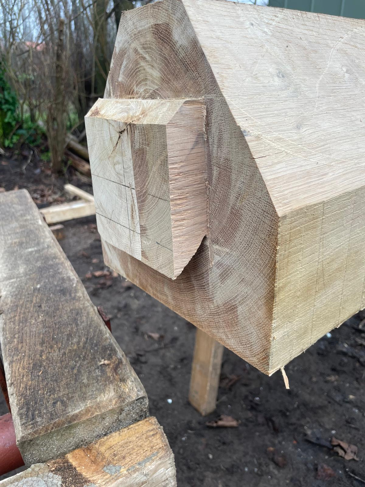

<!DOCTYPE html>
<html lang="nl">
<head>
  <meta charset="UTF-8">
  <meta name="viewport" content="width=device-width, initial-scale=1.0">
  
</head>
<body>

  <header>
    

      

        
      

      <nav>
        <a href="#home">Home</a>
        <a href="#services">Diensten</a>
        <a href="#projects">Projecten</a>
        <a href="#contact">Contact</a>
      </nav>
    

  </header>

  <section class="banner">
    

      
      
      
      
    

  </section>

  

</body>
</html>
