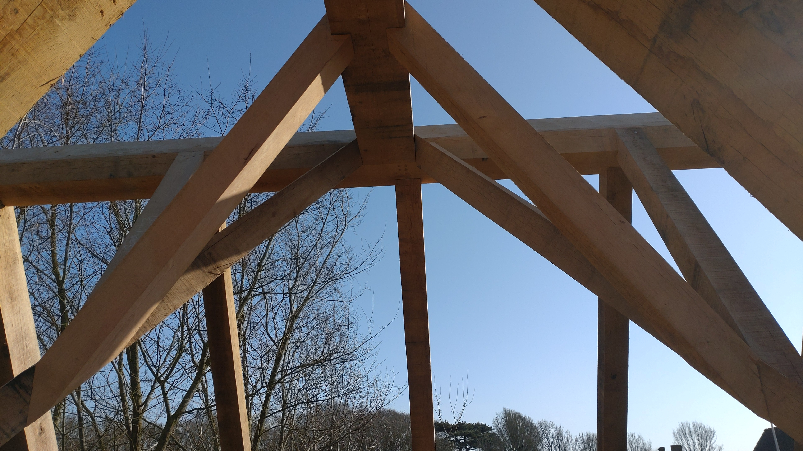

<!DOCTYPE html>
<html lang="nl">
<head>
  <meta charset="UTF-8">
  <meta name="viewport" content="width=device-width, initial-scale=1.0">
  <meta name="description" content="Houtwerk Schiermonnikoog - Specialist in gebintenbouw en houtskeletbouw op Schiermonnikoog.">
  <title>Houtwerk Schiermonnikoog</title>
  <link rel="stylesheet" href="style.css">
  
</head>
<body>
  <header>
  <h1>Houtwerk Schiermonnikoog</h1>
  <nav>
    <a href="index.html">Home</a>
    <a href="projecten.html">Projecten</a>
    <a href="contact.html">Contact</a>
  </nav>
</header>

  <section class="hero">
    <h2>Ambachtelijke Houtbouw op Schiermonnikoog</h2>
    
Gespecialiseerd in gebintenbouw en houtskeletbouw.

  </section>

  <section class="diensten">
    <h2>Onze diensten</h2>
    

      

        <h3>Gebintenbouw</h3>
        
Duurzaam en authentiek handwerk.

      

      

        <h3>Houtskeletbouw</h3>
        
Duurzaam en op maat gemaakte constructies.

      

      

        <h3>Schuren & Overkappingen</h3>
        
Voor tuin, werkplaats of tuinhuis.

      

    

  </section>

  <section class="projecten">
    <h2>Onze Projecten</h2>
    
Bekijk hier een selectie van afgeronde projecten.

    

      

        
        <h3>Project 1</h3>
        
Gebintconstructie met houtskeletbouw.

      

      

        
        <h3>Project 2</h3>
        
Traditionele gebinten schuur.

      

      

        
        <h3>Project 3</h3>
        
Overkapping voor de tuin.

      

    

  </section>

  <section class="contact">
    <h2>Contact</h2>
    
Neem contact op voor een vrijblijvende offerte.

    <form>
      <input type="text" placeholder="Naam" required> 
      <input type="email" placeholder="E-mail" required> 
      <textarea placeholder="Bericht" rows="4"></textarea> 
      <button type="submit">Verstuur</button>
    </form>
  </section>

  <footer>
    
&copy; 2025 Houtwerk Schiermonnikoog

  </footer>
</body>
</html>
